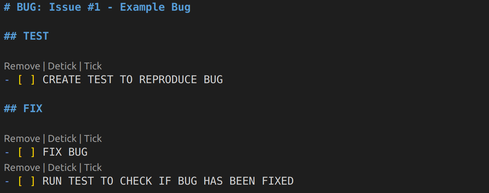
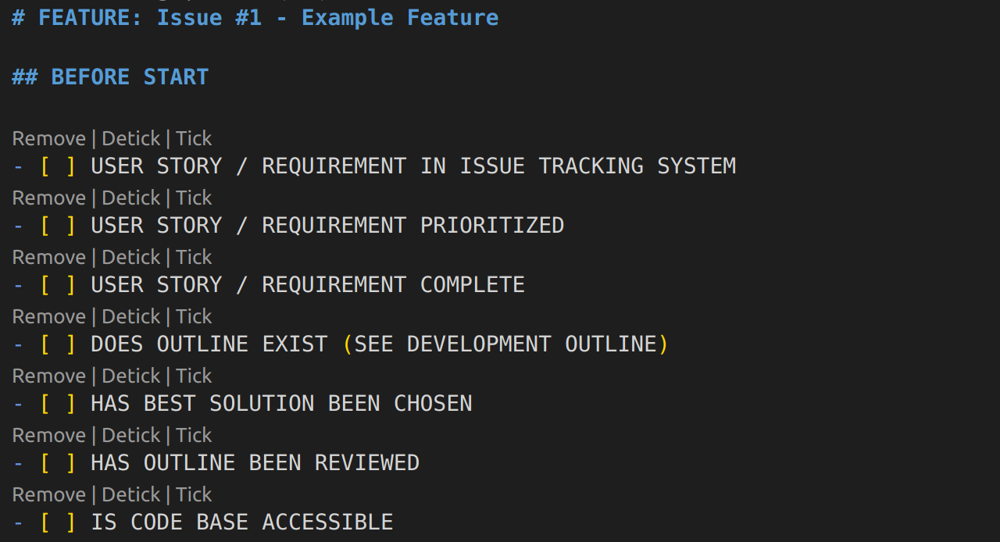
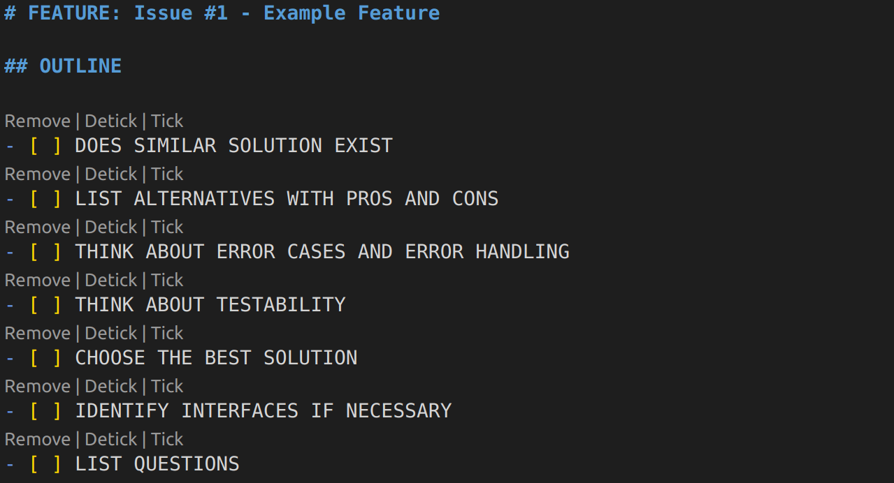
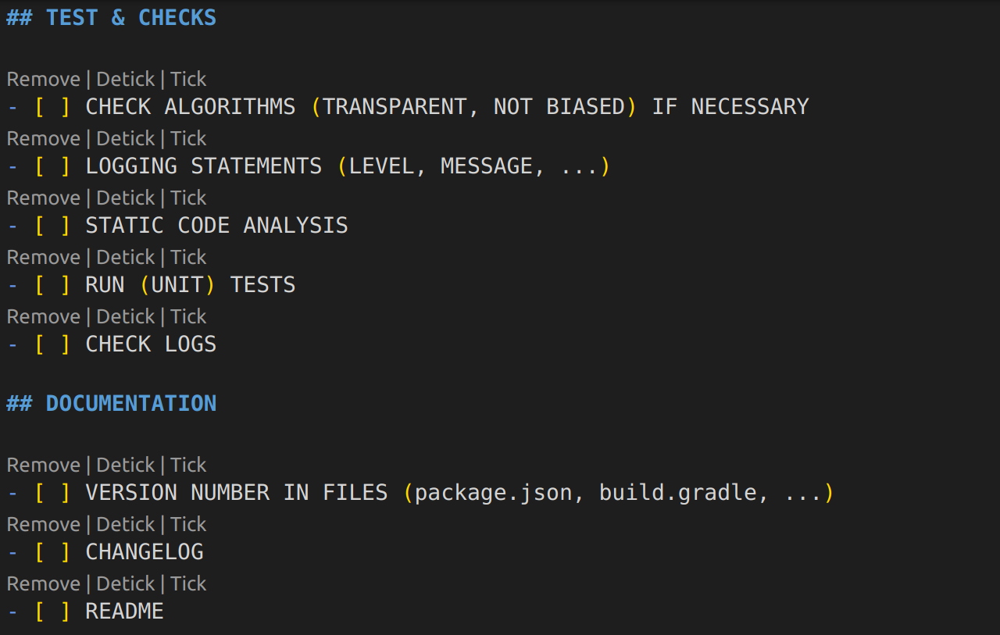
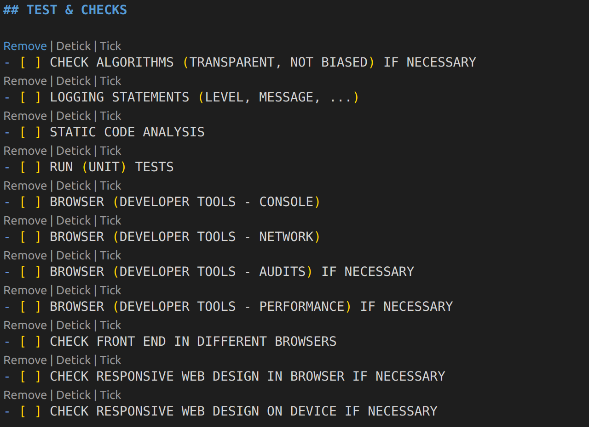
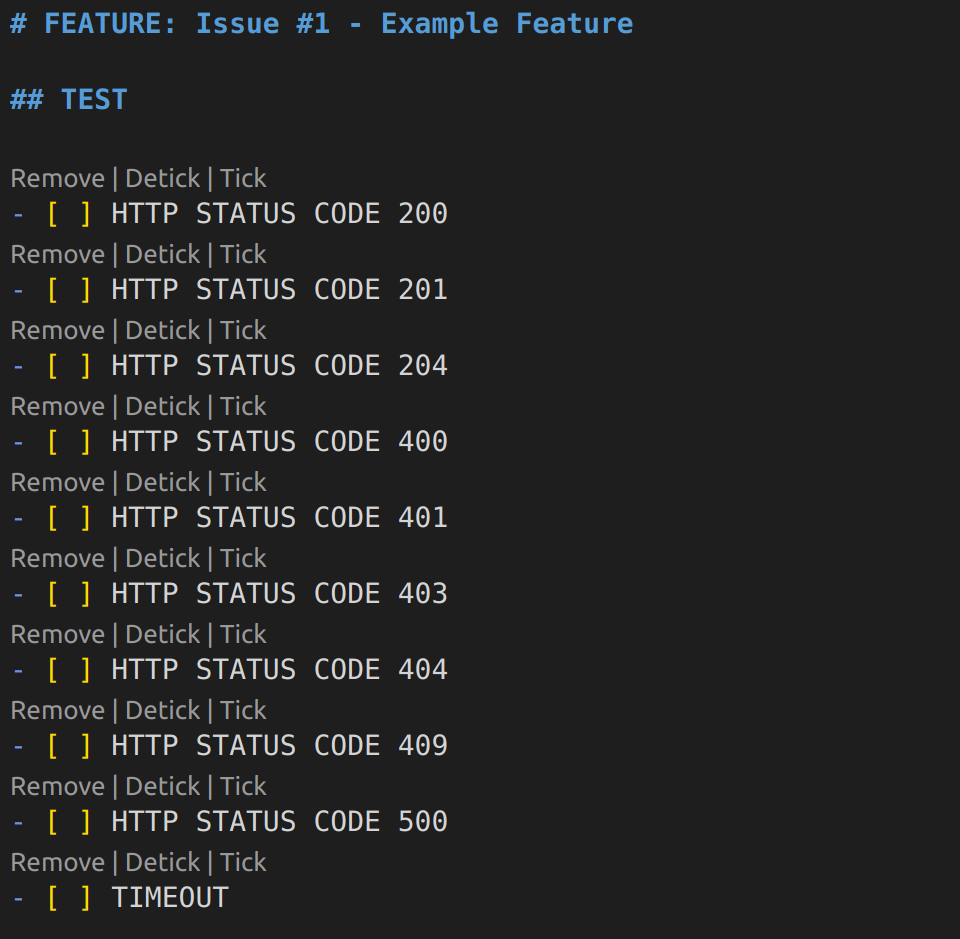
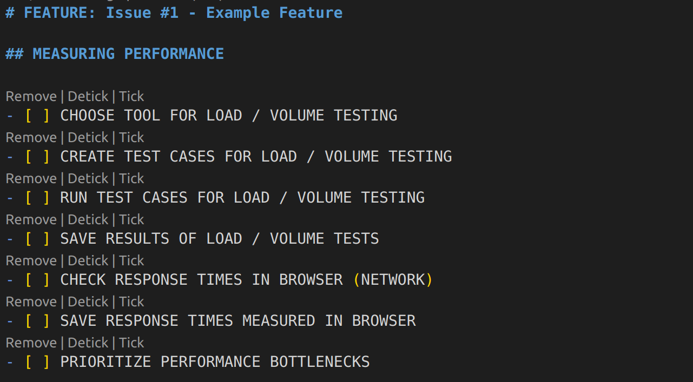
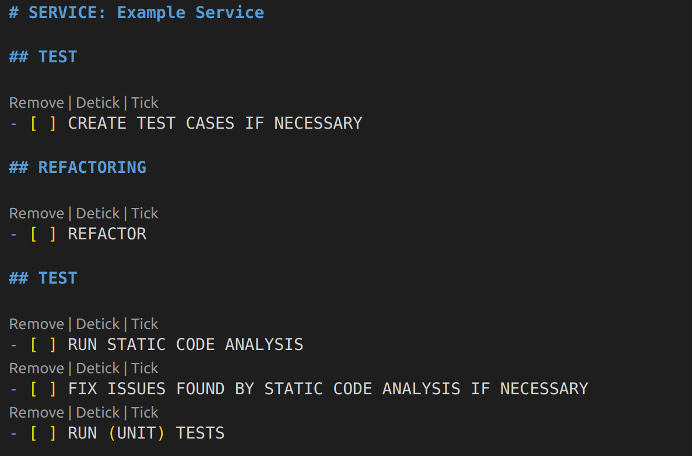
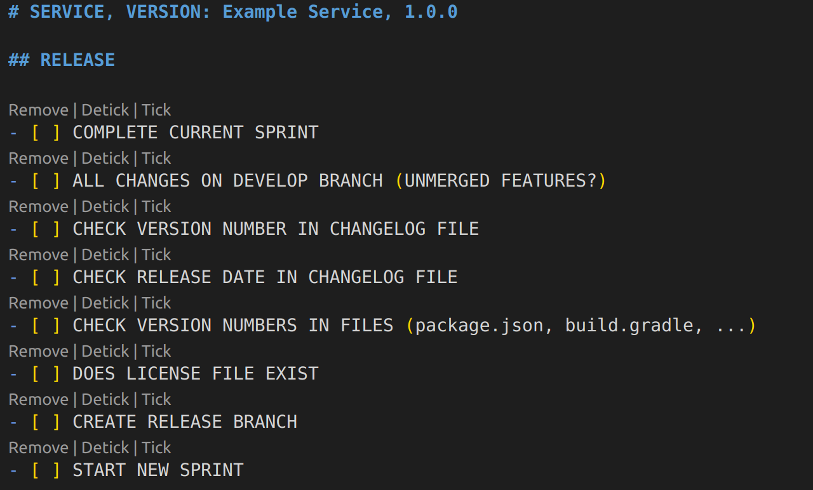
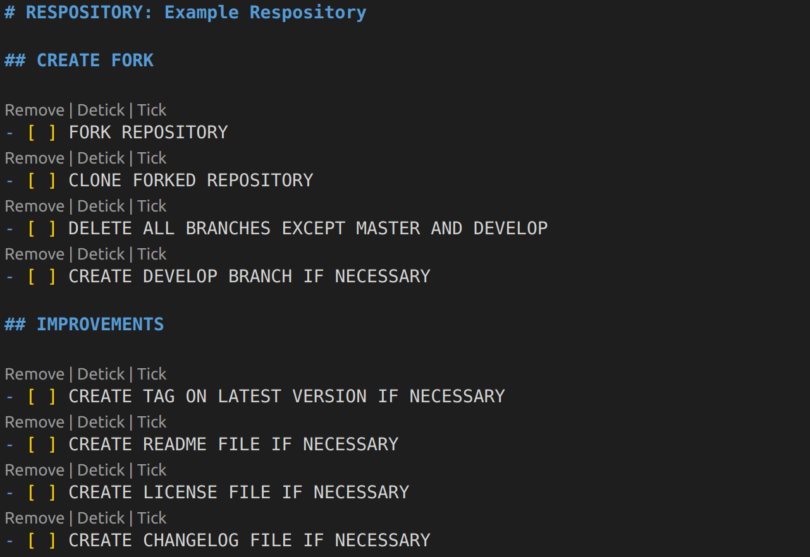

# Software Development Checklists

This project was inspired by checklists in aviation. If checklists can help making flying saver, using checklists during software development can help avoiding common mistakes. You can either use the MD files or print out the checklists. If you use the MD files, I recommend using the Visual Studio Code Extension [MarkDown To-Do (Tomas Hubelbauer)](https://marketplace.visualstudio.com/items?itemName=TomasHubelbauer.vscode-markdown-todo) to tick the checkboxes on the lists.

# Checklists

These checklists are guidelines and do not cover all the different aspects of the software development life cycle. Feel free to adapt the checklists to your own needs.

The screenshots you can see here contain only parts of the checklists in this repository. If you want to see all items on a checklist,
open that checklist.

## Bug Fix Progress Sheet

This checklist guides you through the process while fixing a bug.

## Development Checklist

This checklist guides you through the process of implementing a new feature or fixing a bug. The other checklists are referenced in here.

## Development Outline

We create outlines for our presentations. So why don't we apply a similar concept for planning the features we are going to implement?

This document contains a list of points to think about before implementing a new feature. Feel free to use a sheet of paper or a whiteboard for your ideas.

## Development Progress Sheet Backend

This checklist guides you through the process while implementing a new feature in the backend.

## Development Progress Sheet Frontend

This checklist guides you through the process while implementing a new feature in the frontend.

## HTTP Client Checklist

This checklist guides you through the process while adding an HTTP client.

## Performance Optimization Checklist

This checklist guides you through the performance optimization process of your web app.

## Refactoring Checklist

This checklist guides you through the refactoring process.

## Release Checklist

This checklist guides you through the process of releasing a new version of your web app.

## Repository Checklist

This checklist guides you through the process of forking a repository and improving its quality. You can also use this checklist if you want to improve the quality of your own repository.

# References

https://codeburst.io/think-think-think-before-you-code-52890a917ffd

https://www.freecodecamp.org/news/how-to-write-a-good-software-design-document-66fcf019569c/

https://www.freecodecamp.org/news/how-we-got-a-2-year-old-repo-trending-on-github-in-just-48-hours-12151039d78b/

https://www.restapitutorial.com/httpstatuscodes.html

https://www.askthepilot.com/checklists/
